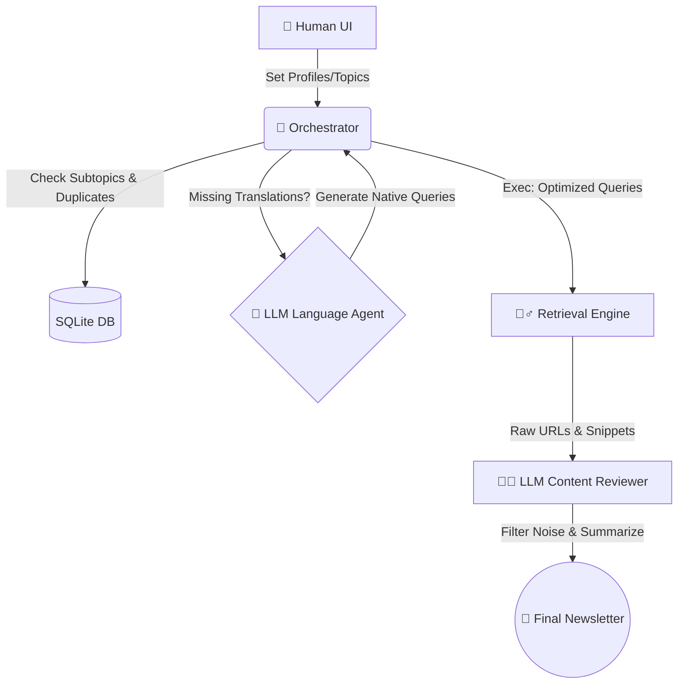

# Notebook Style Guide: Full AI Agent Interaction Simulation

Generated Personal Research Agent v4 notebooks should read like a concise test report that simulates a **Full Interaction Flow** between the Human user and the internal multi-agent ecosystem.

## Structure & Narrative Flow

Il report deve tracciare il viaggio dell'informazione dall'Intake fino all'Output finale, suddividendo la responsabilità tra i vari "Agenti" del sistema (Human, Orchestrator, LLM Researcher, Reviewer).

### 1. 👤 Human Intake & Setup
*   **Ruolo:** Human User.
*   **Task:** Definizione del piano di ricerca tramite Dashboard Web (o Telegram).
*   **Azione:** Imposta i `topics`, seleziona i subtopics, e indica il `geo_scope`.
*   *Esempio Output Message:* "Voglio monitorare le notizie in Italia e gli eventi a Maastricht con profondità 'deep' nei prossimi 14 giorni."

### 2. 🤖 Orchestrator Agent (Data Normalization)
*   **Ruolo:** Pipeline Orchestrator (`app/pipeline.py`).
*   **Task:** Sincronizzare il DB (`db/personal_research_agent.sqlite`), ripulire storici zombie, e preparare i task.
*   **Azione:** `Normalize_topic_setting()`. Rileva le carenze esplicite di attributi traduttivi (`search_query_language`, `optimized_search_queries`).
*   *Esempio Output Message:* "[Orchestrator] Fallback rilevato per 'eventi e tempo libero'. Delego l'LLM Translation Agent per la auto-guarigione delle chiavi linguistiche mancanti."

### 3. 🧠 LLM Translation Agent (Self-Healing)
*   **Ruolo:** Utility LLM (`app/llm.py`).
*   **Task:** Comprendere il `locales` e generare le rigide chiavi SEO native.
*   **Azione:** Produce un JSON con `translated_topic_phrase` e `optimized_search_queries`.
*   *Esempio Output Message:* "Traduco contesto 'eventi e tempo libero' per 'locales: Maastricht' -> `evenementen en vrije tijd`. Genero query native destinate al fetch."

### 4. 🕵️‍♂️ Research & Retrieval Agent
*   **Ruolo:** Web Scraper / Tavily Integrator.
*   **Task:** Ottenere le fonti grezze scartando il rumore.
*   **Azione:** Esegue le `optimized_search_queries` e ottiene N URLs candidate. Valuta l'aderenza semantica in tempo reale.
*   *Esempio Output Message:* "[Scraper] Recuperati 25 URLs per il set di queries native. Passo i dati al Content Reviewer."

### 5. 👨‍🏫 Content Reviewer & Summarizer Agent
*   **Ruolo:** LLM Summarizer.
*   **Task:** Lettura, filtraggio (eliminare duplicati, fonti off-topic o articoli globali non inerenti la richiesta "local") e generazione del Digest.
*   **Azione:** Scrive la `newsletter.md` finale aggregando solo i dati verificati.
*   *Esempio Output Message:* "[Reviewer] Da 25 URLs iniziali, 4 sono state validate di altissima qualità. Digest finale pronto per la Delivery."

## Workflow Graph Diagram

Garantire la chiarezza dell'architettura utilizzando diagrammi Mermaid nativi all'interno della documentazione.

## Tone & Artifact Outputs

*   Use brief factual English (or technical Italian where appropriate).
*   Prefer short paragraphs, explicit validation counts, and neutral observations. 
*   Avoid conversational filler inside generated notebooks.
*   **Data Overview:** Always include total inputs, candidate counts, validation counts (rejection reasons), and selected outputs.
*   **Code Cells:** Code cells simulating the steps should be simple, runnable, and use `pandas` or `matplotlib` for analysis charts.
